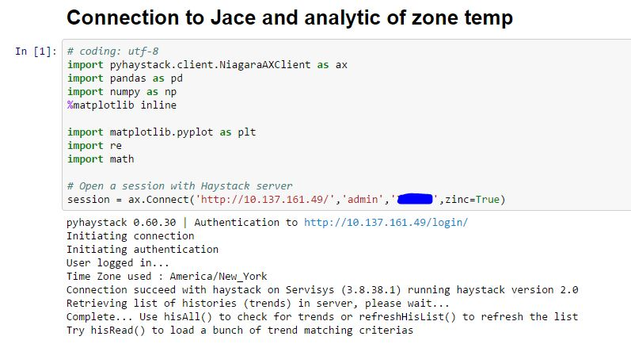
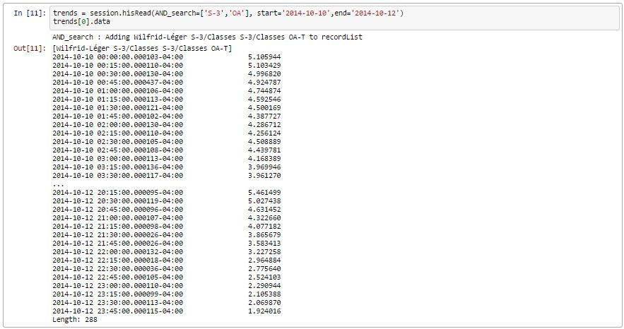
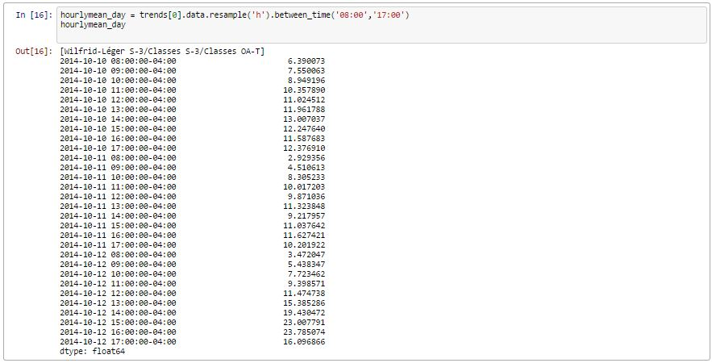
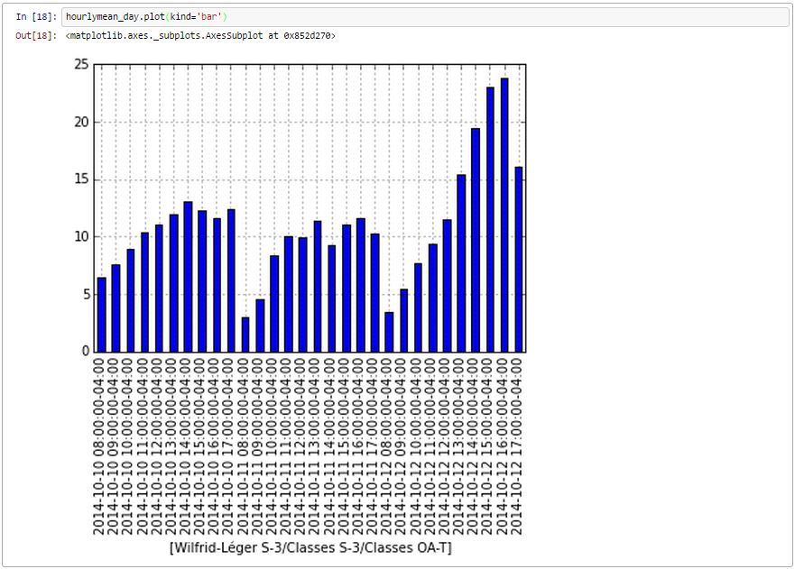

pyhaystack |build-status| |coverage| |docs|
===========================================

Pyhaystack is a module that allow python programs to connect to a haystack server [project-haystack.org](http://www.project-haystack.org).

Actually, connection can be established with Niagara Platform running the nhaystack module, And skyspark application of skyfoundry.

It's a work in progress and actually, main goal is to connect to server and retrive histories to make numeric analysis. Eventually, other options will be implemented through the REST API.

For this to work with [Anaconda](http://continuum.io/downloads) IPython Notebook in Windows, be sure to use "python setup.py install" using the Anaconda Command Prompt in Windows.
If not, module will be installed for System path python but won't work in the environment of Anaconda IPython Notebook.

Using pyhaystack
================
Open a session with Haystack server
-----------------------------------

Example ::
   
	import pyhaystack.client.NiagaraAXClient as ax
    session = ax.Connect('http://serverIP/','user','password',[optional] zinc=True)

    """
    optional zinc parameter is a way to make it work with old Jace NPM2 devices. 
    Those devices aren't able to serve JSON messages due to a too old Java VM. 
    zinc=true will retrieve the zinc output of the server and re-create a Json message so pyhaystack will be able to work with a Json string.
    """"

|Connect|

Fetching data
==============
I've been inspired by Skyspark way of reading haystack so I tried something here with the new function readAll wich is simply a way to pass a filter to a request and get the Json result back as a new class named haystackRead. haystackRead allows functions to facilitate the work ex :

* readDis returns a list of dis
* readId returns a list of id
* readCurVal returns a list of curVal
* showVal returns a dict with dis : curVal
* hasTrend returns True or False depending on the presence of the his tag on any Id
* hisRead returns a list of hisrecord 
         
Example ::

    temp = session.readAll('(sensor and temp and air and (not discharge))').hisRead(start='2015-01-26',end='2015-01-30')

Call list of histories
-----------------------
Fetch every histories::

    hisList = session.hisAll()

Get some trend records as list
--------------------------------

Example ::

    trends = session.hisRead(AND_search=['S-3','OA'], start='2014-10-10',end='2014-10-12')
    trends[0].data
    """"
    OR (with new readAll() function)
    """"
    temp = session.readAll('(sensor and temp and air and (not discharge))').hisRead(start='2015-01-26',end='2015-01-30')

|hisRead|

Use pandas to analyse data
===========================
Compute mean by hour of this record
------------------------------------
Using the "between_time" function you can also get this range of data for every day !::

    hourlymean_day = trends[0].data.resample('h').between_time('08:00','17:00')
    hourlymean_day

|betweentime|

Plot a beautiful graph::

	hourlymean_day.plot(kind='bar')

|hourlymean|

Get some simple stats info on records
--------------------------------------
	
Example::

	trends[0].simpleStats()

|simplestats|

Draw a distribution plots
--------------------------
Distribution plot draw a graph showing how many records are between 20-20.5degC, between 20,5-21degC, etc... ::

	trends[0].breakdownPlot()

|histogram|

.. |simplestats| images:: images/simplestats.jpg
.. |histogram| images:: images/histogram.jpg

.. |build-status| image:: https://travis-ci.org/ChristianTremblay/pyhaystack.svg?branch=master
   :target: https://travis-ci.org/ChristianTremblay/pyhaystack
   :alt: Build status
     
.. |docs| image:: https://readthedocs.org/projects/pyhaystack/badge/?version=latest
   :target: http://pyhaystack.readthedocs.org/
   :alt: Documentation
   
.. |coverage| image:: https://coveralls.io/repos/ChristianTremblay/pyhaystack/badge.svg?branch=master&service=github
   :target: https://coveralls.io/github/ChristianTremblay/pyhaystack?branch=master
   :alt: Coverage

##To Add to README:
[ ] Skyspark example
[ ] Explanation for skyspark connector class

This is the skyspark connector code, based on the work made by Christian Tremblay for NiagaraAX 
Please notice that the Niagara module would probably fail to work since we changed the base Classes to fit our needs. 
The work here was done by Smart-Green inc. for some internal needs but has been released free for the benefit of the community.
